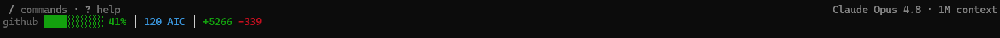

# copilot-status-bar

A rich status line for [GitHub Copilot CLI](https://docs.github.com/copilot/how-tos/use-copilot-agents/use-copilot-cli) that shows, in a single line:

- **Context-window usage** — colored progress bar scaled to 80% of the model limit (green → yellow → orange → red 💀)
- **Current in-progress task** — pulled from the session's `todos` table (if `sqlite3` is on `PATH`)
- **Working directory** — basename of the current dir
- **Premium request count** — from `cost.total_premium_requests`
- **AI Credits (AIC)** — actual GitHub AI Credit usage for the session, read directly from the Copilot payload (`ai_used.formatted` / `ai_used.total_nano_aiu`); this is metered cost, not a token-based estimate
- **Lines added / removed** — running deltas from `cost.total_lines_added` / `total_lines_removed`
- **Remote indicator** — when controlling the session from GitHub web / mobile

Example output:



```
deploy-api │ copilot-status-bar █████░░░░░ 58% │ 12 req │ 12.8 AIC │ +124 -37
```

## Install

### As a plugin (recommended)

```bash
copilot
> /plugin marketplace add mengliburn/copilot-status-bar
> /plugin install copilot-status-bar
```

Then run the bundled installer to wire the status line into `~/.copilot/settings.json`:

**macOS / Linux:**

```bash
bash ~/.copilot/installed-plugins/_direct/mengliburn--copilot-status-bar/scripts/install.sh
```

**Windows (PowerShell):**

```powershell
pwsh -NoProfile -File "$HOME\.copilot\installed-plugins\_direct\mengliburn--copilot-status-bar\scripts\install.ps1"
```

### Manual install

**macOS / Linux:**

```bash
git clone https://github.com/mengliburn/copilot-status-bar.git
cd copilot-status-bar
bash scripts/install.sh
```

**Windows (PowerShell):**

```powershell
git clone https://github.com/mengliburn/copilot-status-bar.git
cd copilot-status-bar
pwsh -NoProfile -File scripts\install.ps1
```

The installer:

1. Copies `statusline/copilot-status-bar.js` to `~/.copilot/hooks/copilot-status-bar.js`
2. Adds (or updates) the `statusLine` block in `~/.copilot/settings.json`:

   ```json
   {
     "statusLine": {
       "type": "command",
       "command": "~/.copilot/hooks/copilot-status-bar.js",
       "padding": 0
     }
   }
   ```

   On **Windows**, the installer instead writes an explicit Node invocation with
   an absolute path, because Copilot CLI runs `statusLine.command` through
   `cmd.exe` — a bare `.js` path is launched by Windows Script Host (not Node, so
   it produces no output), and `~` is not expanded by `cmd.exe`:

   ```json
   {
     "statusLine": {
       "type": "command",
       "command": "node \"C:/Users/<you>/.copilot/hooks/copilot-status-bar.js\"",
       "padding": 0
     }
   }
   ```

3. Backs up the prior settings file to `settings.json.bak`.

Restart `copilot` to see the new status line.

## Requirements

- **Node.js** ≥ 18 (the script is a single-file Node program with no dependencies)
- **`sqlite3` CLI** (optional) — used to surface the active in-progress todo from the session database. The status line works fine without it; the task segment is simply omitted.

## How it works

Copilot CLI invokes the configured `statusLine.command` after every turn and pipes a JSON status payload to its stdin. `copilot-status-bar.js` parses that payload and writes a single ANSI-formatted line to stdout. All errors are swallowed silently — the status line should never break the UI.

Key fields consumed:

| Field | Use |
|---|---|
| `workspace.current_dir`, `cwd` | Directory segment |
| `session_id` | Locate `~/.copilot/session-state/<id>/session.db` to read active todo |
| `context_window.current_context_used_percentage` | Context bar |
| `context_window.remaining_percentage` | Context bar fallback |
| `ai_used.formatted`, `ai_used.total_nano_aiu` | AI Credits (AIC) used |
| `cost.total_premium_requests` | Premium request counter |
| `cost.total_lines_added`, `total_lines_removed` | Code-change deltas |
| `remote.connected`, `remote.indicator` | Remote indicator |

## AI Credits (AIC)

The `AIC` segment shows cumulative **GitHub AI Credit** consumption for the
session, taken straight from the Copilot status payload — it is the actual
metered figure, not an estimate. The script prefers the CLI-provided
`ai_used.formatted` string and falls back to deriving credits from
`ai_used.total_nano_aiu` (1 AI Credit = 1,000,000,000 nano-AIU). The segment is
always shown — including at session start, where it reads `0 AIC` until usage
accrues.

## Persisting status for other tools

By default, on every turn the status line atomically writes a JSON snapshot of
the latest status into `~/.copilot/cache`. This lets a third-party tool (e.g. a
tmux/`polybar` widget, a menu-bar app, or a logger) consume the same data the
bar renders. Two files are written each turn:

- `statusline-<session_id>.json` — per-session, so concurrent Copilot CLI
  sessions never clobber each other's data. Read this to track one session.
- `statusline-latest.json` — a shared, last-writer-wins pointer to whichever
  session rendered most recently. Convenient when you only run one session.

To disable persistence, set `COP_STATUSLINE_NO_PERSIST` to any value other than
`0`/`false`/`no`/`off` (e.g. `export COP_STATUSLINE_NO_PERSIST=1`). When
disabled, nothing is written and behavior is otherwise unchanged.

The snapshot contains normalized `fields`, the verbatim `raw` Copilot payload,
and an ISO-8601 `timestamp`:

```json
{
  "timestamp": "2026-06-16T18:06:39.507Z",
  "session_id": "abc123",
  "fields": {
    "dir": "/home/you/code/copilot-status-bar",
    "dir_name": "copilot-status-bar",
    "task": null,
    "context_used_percentage": 46,
    "context_bar_percentage": 57,
    "aic_text": "120",
    "aic_credits": 120,
    "premium_requests": 12,
    "lines_added": 124,
    "lines_removed": 37,
    "remote": { "connected": true, "indicator": "☁" }
  },
  "raw": { "...": "the full Copilot status payload" }
}
```

Notes:

- `context_used_percentage` is the real usage (0–100); `context_bar_percentage`
  is the value drawn on the bar (scaled to 80% of the model limit).
- `aic_credits` is the numeric AI Credit value; `aic_text` is the displayed
  string (which may be a CLI-preformatted figure).
- Files live in the secure `~/.copilot/cache` directory (created `0700`) and are
  written atomically (temp file + rename) with `0600` permissions. The
  `session_id` is sanitized before use in the filename. Writes are best-effort —
  a persistence failure never breaks the status line.

## Uninstall

1. Remove the `statusLine` block from `~/.copilot/settings.json`
2. `rm ~/.copilot/hooks/copilot-status-bar.js`
3. (If installed as a plugin) `> /plugin uninstall copilot-status-bar` inside `copilot`

## License

MIT — see [LICENSE](./LICENSE).
